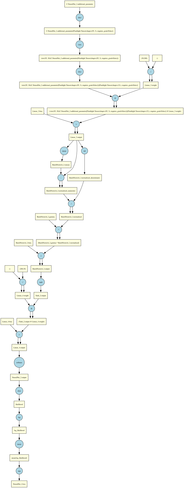
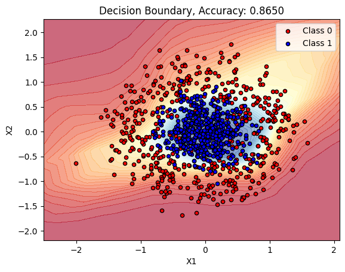

# Flashlight


**Flashlight** is a super lightweight library I created for my own learning and it will not help you at all in building complex neural nets.

However, if you are creating a simple MLP using Linear + Batchnorm layers and basic non linearlities, you can use this for your mini learning projects.

P.S - I wasted more than 50 sheets of paper to derive the derivatives of log, mean, tanh etc myself for this.

## Motivation

I am a software engineer on a journey to self-learn deep learning and re-ignite my curiosity for physics and mathematics.

This project was born out of a desire to stop treating deep learning libraries as "black boxes." Inspired by **Andrej Karpathy** and his incredible [micrograd](https://github.com/karpathy/micrograd) video, I decided that the only way to truly understand the math and mechanics of **backpropagation** was to build the engine myself.

Building **Flashlight** allowed me to:

- Derive gradients manually and implement the **Chain Rule** in code.
- Understand how computational graphs are built and traversed (Topological Sort).
- Tackle the complexities of **matrix broadcasting** during the backward pass (a common pain point in tensor calculus!).

## Features

While minimalistic, Flashlight handles the heavy lifting required to train standard neural networks:

- **Autograd Engine:** A fully functional reverse-mode automatic differentiation engine.
- **Tensor Operations:** Support for matrix multiplication (`@`), addition, subtraction, division, and negation.
- **Broadcasting:** Automatically handles shape mismatches during arithmetic operations (and correctly reduces gradients during the backward pass).
- **Activation Functions:** Built-in support for `tanh`, `relu`, `softmax`, `log`, and `exp`.
- **Statistical Ops:** Implementations of `mean`, `std`, and `sum` with dimension specifications (crucial for Batch Normalization).
- **Slicing & Indexing:** Support for advanced indexing and masking with gradient tracking.
- **PyTorch-like API:** Familiar syntax (`x.backward()`, `x.grad`, `x.data`) makes it easy to read for anyone familiar with Torch.
- **Neural Network Layers:** Pre-built layers including Linear, BatchNorm1d, Tanh, Relu, and a NeuralNet container for building models.

#### Here's a computational graph created by the flashlight autograd engine



Awesome, isn't it?

## Benchmarks

### The "Makemore" Implementation

The core benchmark for this library is **`lab.ipynb`**.

This notebook contains a Multilayer Perceptron (MLP) character-level language model (based on the "Makemore" architecture). It was originally written in PyTorch. I systematically stripped away the PyTorch dependencies and replaced them with **Flashlight** to prove that my engine could handle real training loops.

It successfully trains on `names.txt` using:

- Learned Embeddings
- Hidden Layers
- Batch Normalization
- Tanh Non-linearity
- Cross-Entropy Loss

### Make Circles Classification

Another benchmark is **`make_circles.ipynb`**, which demonstrates binary classification on the scikit-learn make_circles dataset.

The model uses Linear and ReLU layers to learn a non-linear decision boundary for separating two concentric circles. This showcases the library's ability to handle non-linear classification tasks.



The model achieves high accuracy on this task, demonstrating that Flashlight can effectively train neural networks for real classification problems.

## Project Structure

- `flashlight/Tensor.py`: The heart of the library. Contains the `Tensor` class, the DAG (Directed Acyclic Graph) construction, and the `.backward()` logic.
- `flashlight/functions.py`: Functional wrappers for activations and math operations.
- `flashlight/creators.py`: Factory functions (`randn`, `zeros`, `ones`, `randint`) to initialize tensors.
- `flashlight/neural/`: Neural network layers and utilities.
  - `Linear.py`: Fully connected layer with optional bias
  - `BatchNorm1d.py`: Batch normalization for 1D inputs
  - `Tanh.py`: Tanh activation layer
  - `Relu.py`: ReLU activation layer
  - `NeuralNet.py`: Container class for building and training neural networks
- `lab.ipynb`: The training playground. A character-level language model trained using Flashlight.
- `make_circles.ipynb`: Binary classification benchmark using scikit-learn's make_circles dataset.

## Usage Example

### Basic Tensor Operations

```python
import flashlight
import numpy as np

# Create tensors
x = flashlight.Tensor([[2.0, 3.0]], requires_grad=True)
w = flashlight.Tensor([[1.5], [0.5]], requires_grad=True)

# Perform operations (Matrix Multiplication)
y = x @ w

# Activation
out = y.tanh()

# Backpropagation
out.backward()

print(f"Output: {out.data}")
print(f"Gradient of x: {x.grad.data}")
print(f"Gradient of w: {w.grad.data}")
```

### Building Neural Networks

You can use the neural package to build models more easily:

```python
from flashlight import neural
from flashlight import Tensor, randn
from flashlight.functions import nll_loss, softmax

# Define your model architecture
def calculate_output(x):
    return x

def calculate_loss(output, target):
    probs = softmax(output, dim=-1)
    return nll_loss(probs, target)

# Create the network
net = neural.NeuralNet(
    calculate_output=calculate_output,
    calculate_loss=calculate_loss
)

# Add layers
net.add_layer(neural.Linear(784, 128))
net.add_layer(neural.Tanh())
net.add_layer(neural.Linear(128, 64))
net.add_layer(neural.BatchNorm1d(64, training=True))
net.add_layer(neural.Tanh())
net.add_layer(neural.Linear(64, 10))

# Training loop
x = randn(32, 784)  # batch of 32, 784 features
y = Tensor([0, 1, 2, 3, 4, 5, 6, 7, 8, 9] * 3 + [0, 1])  # targets

for epoch in range(100):
    loss = net.train(x, y, lr=0.01)
    if epoch % 10 == 0:
        print(f"Epoch {epoch}, Loss: {loss.item():.4f}")
```

The NeuralNet class handles forward passes, loss computation, and gradient updates. You can also manually control the training:

```python
# Manual training control
net.set_training(True)  # or False for eval mode
output = net(x)  # forward pass
loss = net.forward(x, y)  # forward + loss
loss.backward()

# Update parameters manually
for param in net.parameters():
    if param.grad is not None:
        param.data -= 0.01 * param.grad.data
        param.grad = None
```

## Testing

There's a test suite in `flashlight/test/` that covers tensor operations, gradient correctness, and neural layer functionality. Run the tests like this:

```bash
# Run all tests
python -m pytest flashlight/test/ -v

# Run specific test file
python -m pytest flashlight/test/test_tensor_operations.py

# Run gradient tests
python -m pytest flashlight/test/test_gradients.py -v
```

There are also benchmarks if you want to see performance characteristics:

```bash
python -m flashlight.test.test_benchmarks
```

This generates plots in `benchmark_results/` showing performance across different tensor sizes and operations. The test suite includes:

- Tensor operation accuracy tests (comparing against numpy)
- Gradient correctness verification (including numerical gradient checks)
- Neural layer tests (Linear, BatchNorm1d, Tanh, Relu)
- Additional edge cases and numerical stability tests

## Acknowledgements

- **Andrej Karpathy:** For the _Micrograd_ and _Makemore_ series, which are the gold standard for deep learning education.
- **NumPy:** For doing the heavy lifting on the actual matrix math.
