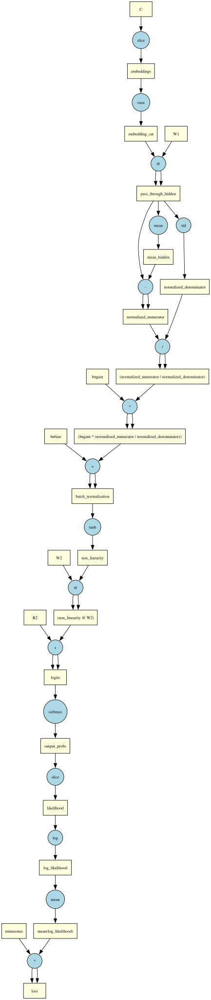

# Flashlight 🔦


**Flashlight** is a super lightweight, library I created for my own learning and it will not help you at all in building Complex Neural nets.

However, if you are creating a simple MLP using Linear + Batchnorm layers and basic non linearlities, you can use this for your mini learning projects.

P.S - I wasted more than 50 sheets of paper to derive the derivatives of log, mean, tanh etc myself for this.

## Motivation

I am a software engineer on a journey to self-learn deep learning and re-ignite my curiosity for physics and mathematics.

This project was born out of a desire to stop treating deep learning libraries as "black boxes." Inspired by **Andrej Karpathy** and his incredible [micrograd](https://github.com/karpathy/micrograd) video, I decided that the only way to truly understand the math and mechanics of **backpropagation** was to build the engine myself.

Building **Flashlight** allowed me to:

- Derive gradients manually and implement the **Chain Rule** in code.
- Understand how computational graphs are built and traversed (Topological Sort).
- Tackle the complexities of **matrix broadcasting** during the backward pass (a common pain point in tensor calculus!).

## Features

While minimalistic, Flashlight handles the heavy lifting required to train standard neural networks:

- **Autograd Engine:** A fully functional reverse-mode automatic differentiation engine.
- **Tensor Operations:** Support for matrix multiplication (`@`), addition, subtraction, division, and negation.
- **Broadcasting:** Automatically handles shape mismatches during arithmetic operations (and correctly reduces gradients during the backward pass).
- **Activation Functions:** Built-in support for `tanh`, `softmax`, `log`, and `exp`.
- **Statistical Ops:** Implementations of `mean`, `std`, and `sum` with dimension specifications (crucial for Batch Normalization).
- **Slicing & Indexing:** Support for advanced indexing and masking with gradient tracking.
- **PyTorch-like API:** Familiar syntax (`x.backward()`, `x.grad`, `x.data`) makes it easy to read for anyone familiar with Torch.

#### Here's a computational graph created by the flashlight autograd engines



Awesome, isn't it?

## The "Makemore" Implementation

The core benchmark for this library is **`lab.ipynb`**.

This notebook contains a Multilayer Perceptron (MLP) character-level language model (based on the "Makemore" architecture). It was originally written in PyTorch. I systematically stripped away the PyTorch dependencies and replaced them with **Flashlight** to prove that my engine could handle real training loops.

It successfully trains on `names.txt` using:

- Learned Embeddings
- Hidden Layers
- Batch Normalization
- Tanh Non-linearity
- Cross-Entropy Loss

## Project Structure

- `flashlight/Tensor.py`: The heart of the library. Contains the `Tensor` class, the DAG (Directed Acyclic Graph) construction, and the `.backward()` logic.
- `flashlight/functions.py`: Functional wrappers for activations and math operations.
- `flashlight/creators.py`: Factory functions (`randn`, `zeros`, `ones`, `randint`) to initialize tensors.
- `lab.ipynb`: The training playground. A character-level language model trained using Flashlight.

## Usage Example

```python
import flashlight
import numpy as np

# Create tensors
x = flashlight.Tensor([[2.0, 3.0]], requires_grad=True)
w = flashlight.Tensor([[1.5], [0.5]], requires_grad=True)

# Perform operations (Matrix Multiplication)
y = x @ w

# Activation
out = y.tanh()

# Backpropagation
out.backward()

print(f"Output: {out.data}")
print(f"Gradient of x: {x.grad.data}")
print(f"Gradient of w: {w.grad.data}")

```

## Acknowledgements

- **Andrej Karpathy:** For the _Micrograd_ and _Makemore_ series, which are the gold standard for deep learning education.
- **NumPy:** For doing the heavy lifting on the actual matrix math.
